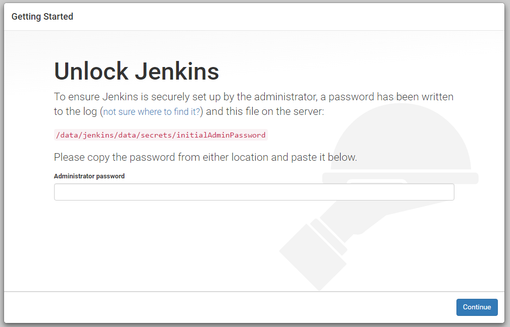

# Jenkins Pipeline 101

## Install Oracle Java

Oracle JDK를 설치합니다. root 또는 sudo 권한이 있는 사용자로 설치합니다.

```bash
# ---------------------------------------------
# jdk를 설치할 디렉토리를 생성합니다.
$ sudo mkdir -p /usr/java
```

### Java 7

```bash
$ cd /usr/java
$ sudo wget --no-check-certificate --no-cookies \
    --header "Cookie: oraclelicense=accept-securebackup-cookie" \
    http://download.oracle.com/otn-pub/java/jdk/7u80-b15/jdk-7u80-linux-x64.tar.gz
$ sudo tar xvzf jdk-7u80-linux-x64.tar.gz
$ sudo ln -s ./jdk1.7.0_80 jdk1.7.0
$ sudo rm -rf jdk-7u80-linux-x64.tar.gz
$ cd /usr/java/jdk1.7.0/bin
$ ./java -version
```

### Java 8

```bash
$ cd /usr/java
$ sudo wget --no-check-certificate --no-cookies \
    --header "Cookie: oraclelicense=accept-securebackup-cookie" \
    http://download.oracle.com/otn-pub/java/jdk/8u102-b14/jdk-8u102-linux-x64.tar.gz
$ sudo tar xvzf jdk-8u102-linux-x64.tar.gz
$ sudo ln -s ./jdk1.8.0_102 jdk1.8.0
$ sudo rm -rf jdk-8u102-linux-x64.tar.gz
$ cd /usr/java/jdk1.8.0/bin
$ ./java -version
```

## Create Jenkins User

root 또는 sudo 권한이 있는 사용자로 jenkins 계정을 생성합니다.

```bash
# ---------------------------------------------
# 사용자 그룹을 생성합니다.
$ sudo groupadd jenkins

# ---------------------------------------------
# 사용자를 생성합니다.
$ sudo useradd -s /bin/bash -d /home/jenkins -m -g jenkins jenkins

# ---------------------------------------------
# 사용자 비밀번호를 생성합니다.
$ sudo passwd jenkins
  !j3Nk1Ns#79124
```

## create directory structures

jenkins의 작업 디렉토리를 생성합니다.

```bash
# ---------------------------------------------
# as root or sudo user
# /data/jenkins/src 디렉토리를 생성합니다.
$ sudo mkdir -p /data/jenkins/engine /data/jenkins/data /data/jenkins/maven/repo /data/jenkins/ant
$ sudo chown -Rf jenkins:jenkins /data/jenkins
```

## install build tools 

Java에서 주로 많이 쓰이는 Build Tools을 미리 설치하도록 하겠습니다. 여기서는 Apache Ant와 Apache Maven을 설치하도록 하겠습니다.

### Apache Maven

```bash
# ---------------------------------------------
# jenkins 사용자로 전환합니다.
$ sudo su - jenkins

# ---------------------------------------------
# 작업 디렉토리를 생성합니다.
$ cd /data/jenkins/maven

# ---------------------------------------------
# 다운로드 받습니다.
$ wget http://apache.mirror.cdnetworks.com/maven/maven-3/3.3.9/binaries/apache-maven-3.3.9-bin.tar.gz

# ---------------------------------------------
# 압축을 해제합니다.
$ tar xvzf apache-maven-3.3.9-bin.tar.gz
```

설치가 완료되었습니다. 이제 Local Repository Directory를 설정해 줍니다.

```bash
$ cd /data/jenkins/maven/apache-maven-3.3.9/conf
$ vi settings.xml
```

```xml
<?xml version="1.0" encoding="UTF-8"?>

<settings xmlns="http://maven.apache.org/SETTINGS/1.0.0"
          xmlns:xsi="http://www.w3.org/2001/XMLSchema-instance"
          xsi:schemaLocation="http://maven.apache.org/SETTINGS/1.0.0 
            http://maven.apache.org/xsd/settings-1.0.0.xsd">
  <!-- localRepository
   | The path to the local repository maven will use to store artifacts.
   |
   | Default: ${user.home}/.m2/repository
  <localRepository>/path/to/local/repo</localRepository>
  -->
  <!-- 위에서 생성한 디렉토리를 지정한다. -->
  <localRepository>/data/jenkins/maven/repo</localRepository>

  <!-- interactiveMode
   | This will determine whether maven prompts you when it needs input. If set to false,
   | maven will use a sensible default value, perhaps based on some other setting, for
   | the parameter in question.
   |
   | Default: true
  <interactiveMode>true</interactiveMode>
  -->

. . .
```

추가적으로 사용자의 Home Directory에 `~/.m2` Directory를 생성하고 settings.xml을 생성한 후, Local Repository Directory를 지정해 줍니다.

> 이렇게 하는 이유는 중복되어 저장되는 것을 막기 위해서 입니다.

```bash
$ mkdir -p ~/.m2
$ cd ~/.m2
$ touch settings.xml
$ vi settings.xml
```

```xml
<?xml version="1.0" encoding="UTF-8"?>

<settings xmlns="http://maven.apache.org/SETTINGS/1.0.0"
          xmlns:xsi="http://www.w3.org/2001/XMLSchema-instance"
          xsi:schemaLocation="http://maven.apache.org/SETTINGS/1.0.0 
            http://maven.apache.org/xsd/settings-1.0.0.xsd">
  <localRepository>/data/jenkins/maven/repo</localRepository>
</settings>
```

### Apache Ant

```bash
# ---------------------------------------------
# jenkins 사용자로 전환합니다.
$ sudo su - jenkins

# ---------------------------------------------
# 작업 디렉토리를 생성합니다.
$ cd /data/jenkins/ant

# ---------------------------------------------
# 다운로드 받습니다.
$ wget http://apache.mirror.cdnetworks.com//ant/binaries/apache-ant-1.9.7-bin.tar.gz

# ---------------------------------------------
# 압축을 해제합니다.
$ tar xvzf apache-ant-1.9.7-bin.tar.gz
```

설치가 완료되었습니다. Apache Ant는 별도로 설정할 것이 없습니다.

## install jenkins

[jenkins.io](https://jenkins.io)에서 Jenkins를 [다운로드](http://mirrors.jenkins-ci.org/war-stable/latest/jenkins.war)(2.7.3 LTS Version) 받습니다.

```bash
# jenkins 사용자로 전환합니다.
$ sudo su - jenkins

# 작업 디렉토리로 이동합니다.
$ cd /data/jenkins/engine

# 다운로드 받습니다.
$ wget -O jenkins-2.7.3.LTS.war http://mirrors.jenkins-ci.org/war-stable/latest/jenkins.war
```


## create shellscripts

```bash
$ cd /data/jenkins/engine
$ touch env.sh startJenkins.sh stopJenkins.sh restartJenkins.sh tail.sh && chmod 700 *.sh
```

### env.sh

```bash
$ cd /data/jenkins/engine
$ vi env.sh
```

```bash
#!/bin/bash
# env.sh

export JAVA_HOME="/usr/java/jdk1.8.0"
export JENKINS_HOME="/data/jenkins/data"
export JENKINS_BASE="/data/jenkins/engine"
export JENKINS_LOG="${JENKINS_BASE}/logs"
export JENKINS_VER="2.7.3.LTS"

export JENKINS_PREFIX="/ci"
export JENKINS_HTTP_PORT=28080
export JENKINS_CTRL_PORT=28005

if [ "x${JENKINS_OPTS}" = "x" ]; then
    JENKINS_OPTS="--prefix=${JENKINS_PREFIX}"
    JENKINS_OPTS="${JENKINS_OPTS} --httpPort=${JENKINS_HTTP_PORT}"
    # JENKINS_OPTS="${JENKINS_OPTS} --ajp13Port=${JENKINS_AJP_PORT}"
    JENKINS_OPTS="${JENKINS_OPTS} --controlPort=${JENKINS_CTRL_PORT}"
fi
export JENKINS_OPTS

if [ "x${JAVA_OPTS}" = "x" ]; then
    JAVA_OPTS="-server"
    JAVA_OPTS="${JAVA_OPTS} -Xverify:none"
    JAVA_OPTS="${JAVA_OPTS} -Dserver=jenkins"

    JAVA_OPTS="${JAVA_OPTS} -DJENKINS_HOME=${JENKINS_HOME}"

    # ----------------------
    # java memery opts
    # ----------------------
    JAVA_OPTS="${JAVA_OPTS} -Djava.awt.headless=true"
    JAVA_OPTS="${JAVA_OPTS} -Xms1024m"
    JAVA_OPTS="${JAVA_OPTS} -Xmx1024m"
    JAVA_OPTS="${JAVA_OPTS} -Xss2m"
    # JAVA_OPTS="${JAVA_OPTS} -XX:PermSize=256m"
    # JAVA_OPTS="${JAVA_OPTS} -XX:MaxPermSize=256m"

    # ----------------------
    # java gc opts
    # ----------------------
    JAVA_OPTS="${JAVA_OPTS} -verbose:gc"
    JAVA_OPTS="${JAVA_OPTS} -Xloggc:${JENKINS_LOG}/gc.log"
    JAVA_OPTS="${JAVA_OPTS} -XX:+PrintGCDetails"
    JAVA_OPTS="${JAVA_OPTS} -XX:+PrintGCTimeStamps"
    JAVA_OPTS="${JAVA_OPTS} -XX:+PrintHeapAtGC"
    JAVA_OPTS="${JAVA_OPTS} -XX:+HeapDumpOnOutOfMemoryError"
    JAVA_OPTS="${JAVA_OPTS} -XX:HeapDumpPath=${JENKINS_LOG}/java_pid.hprof"
fi
export JAVA_OPTS

echo "========================================================"
echo " JAVA_HOME=${JAVA_HOME}"
echo "JENKINS_BASE=${JENKINS_BASE}"
echo "JENKINS_HOME=${JENKINS_HOME}"
echo " JAVA_OPTS=${JAVA_OPTS}"
echo "JENKINS_OPTS=${JENKINS_OPTS}"
echo "========================================================"
```

### startJenkins.sh

```bash
$ cd /data/jenkins/engine
$ vi startJenkins.sh
```

```bash
#!/bin/bash
# startJenkins.sh

. ./env.sh

CURDT=`date '+%Y%m%d%H%M%S'`
if [ ! -d ${JENKINS_LOG} ]; then
    mkdir -p ${JENKINS_LOG}
fi

if [ -f ${JENKINS_LOG}/server.log ]; then
    # echo "backup server.log to server.log.${CURDT}"
    mv ${JENKINS_LOG}/server.log ${JENKINS_LOG}/server.log.${CURDT}
fi

nohup ${JAVA_HOME}/bin/java ${JAVA_OPTS} -jar ${JENKINS_BASE}/jenkins-${JENKINS_VER}.war ${JENKINS_OPTS} > ${JENKINS_LOG}/server.log 2>&1 &
```

### stopJenkins.sh

```bash
$ cd /data/jenkins/engine
$ vi stopJenkins.sh
```

```bash
#!/bin/bash
# stopJenkins.sh 

. ./env.sh

unset JAVA_OPTS
unset JENKINS_OPTS

if [ "x${JENKINS_OPTS}" = "x" ]; then
    # ----------------------
    # jenkins opts
    # ----------------------
    JENKINS_OPTS="--host=localhost"
    JENKINS_OPTS="${JENKINS_OPTS} --port=${JENKINS_CTRL_PORT}"
fi
export JENKINS_OPTS

${JAVA_HOME}/bin/java -cp ${JENKINS_HOME}/war/winstone.jar winstone.tools.WinstoneControl shutdown ${JENKINS_OPTS}
```

### restartJenkins.sh

```bash
$ cd /data/jenkins/engine
$ vi restartJenkins.sh
```

```bash
#!/bin/bash
# restartJenkins.sh

. ./env.sh

unset JAVA_OPTS
unset JENKINS_OPTS

if [ "x${JENKINS_OPTS}" = "x" ]; then
    # ----------------------
    # jenkins opts
    # ----------------------
    JENKINS_OPTS="--host=localhost"
    JENKINS_OPTS="${JENKINS_OPTS} --port=${JENKINS_CTRL_PORT}"
fi
export JENKINS_OPTS

${JAVA_HOME}/bin/java -cp ${JENKINS_HOME}/war/winstone.jar winstone.tools.WinstoneControl reload:${JENKINS_PREFIX} ${JENKINS_OPTS}
```

### tail.sh

```bash
$ cd /data/jenkins/engine
$ vi tail.sh
```

```bash
#!/bin/bash
# tail.sh

export JENKINS_BASE="/data/jenkins/engine"
export JENKINS_LOG="${JENKINS_BASE}/logs"

tail -f ${JENKINS_LOG}/server.log
```

## running jenkins

시험삼아 한번 실행해 봅니다.

```bash
$ /usr/java/jdk1.8.0/bin/java -server -Xverify:none \
    -Dserver=jenkins -DJENKINS_HOME=/data/jenkins/data \
    -jar jenkins-2.7.3.LTS.war \
    --prefix="/jenkins" --httpPort=28080 --controlPort=28005
```

위에서 생성한 ShellScript를 실행해 봅니다.

```bash
$ cd /data/jenkins/engine
$ ./startJenkins.sh ; ./tail.sh
```

```
. . .
Sep 08, 2016 12:47:18 AM org.springframework.context.support.AbstractApplicationContext prepareRefresh
INFO: Refreshing org.springframework.web.context.support.StaticWebApplicationContext@79e0f80f: display name [Root WebApplicationContext]; startup date [Thu Sep 08 00:47:18 KST 2016]; root of context hierarchy
Sep 08, 2016 12:47:18 AM org.springframework.context.support.AbstractApplicationContext obtainFreshBeanFactory
INFO: Bean factory for application context [org.springframework.web.context.support.StaticWebApplicationContext@79e0f80f]: org.springframework.beans.factory.support.DefaultListableBeanFactory@644386d2
Sep 08, 2016 12:47:18 AM org.springframework.beans.factory.support.DefaultListableBeanFactory preInstantiateSingletons
INFO: Pre-instantiating singletons in org.springframework.beans.factory.support.DefaultListableBeanFactory@644386d2: defining beans [authenticationManager]; root of factory hierarchy
Sep 08, 2016 12:47:19 AM org.springframework.context.support.AbstractApplicationContext prepareRefresh
INFO: Refreshing org.springframework.web.context.support.StaticWebApplicationContext@1832cfcf: display name [Root WebApplicationContext]; startup date [Thu Sep 08 00:47:19 KST 2016]; root of context hierarchy
Sep 08, 2016 12:47:19 AM org.springframework.context.support.AbstractApplicationContext obtainFreshBeanFactory
INFO: Bean factory for application context [org.springframework.web.context.support.StaticWebApplicationContext@1832cfcf]: org.springframework.beans.factory.support.DefaultListableBeanFactory@1c385bca
Sep 08, 2016 12:47:19 AM org.springframework.beans.factory.support.DefaultListableBeanFactory preInstantiateSingletons
INFO: Pre-instantiating singletons in org.springframework.beans.factory.support.DefaultListableBeanFactory@1c385bca: defining beans [filter,legacy]; root of factory hierarchy
Sep 08, 2016 12:47:19 AM jenkins.install.SetupWizard init
INFO: 

*************************************************************
*************************************************************
*************************************************************

Jenkins initial setup is required. An admin user has been created and a password generated.
Please use the following password to proceed to installation:

68ac5f48e3a34b8ab5d9186b484043f8

This may also be found at: /data/jenkins/data/secrets/initialAdminPassword

*************************************************************
*************************************************************
*************************************************************

Sep 08, 2016 12:47:24 AM hudson.model.UpdateSite updateData
INFO: Obtained the latest update center data file for UpdateSource default
Sep 08, 2016 12:47:24 AM hudson.WebAppMain$3 run
INFO: Jenkins is fully up and running

```

설치하고 실행이 완료되었습니다.

## 설치 후, 기본 설정

http://jenkins.host:28080/jenkins에 접근하면 다음과 같은 화면을 볼 수 있습니다. Jenkins 2부터 초기 설정을 간단하게 할 수 있도록 변경된 부분입니다.



위 화면의 `Administrator password` 에 최초 실행시 출력되는 Password를 입력하면 됩니다. 해당 값을 모를 경우 아래의 명령어를 실행하여 확인할 수 있습니다.

```bash
$ cat /data/jenkins/data/secrets/initialAdminPassword
```

`Administrator password`를 입력하고 `Continue` 버튼을 누르면, Jenkins의 기능을 확장해주는 Plugin 설치에 대해 나옵니다. 권장하는 plugin을 설치할 것인가? 직접 선택하여 설치할 것인가?를 선택할 수 있습니다.


기본적으로 권장하는 것을 선택하도록 하겠습니다. `Install suggested plugins` 버튼을 클릭합니다.


어떤 Plugin들이 설치되는지 확인할 수 있습니다. 설치가 완료되면 자동으로 관리자 사용자를 생성하는 화면이 나옵니다. 여기에 다음과 같이 입력합니다.


| 항목 | 값 |
| --- | --- |
| 계정명 | admin |
| 암호/암호확인 | !admin#12 |
| 이름 | Administrator |
| 이메일 주소 | admin@yourdomain |

값을 입력한 후, `Continue as admin` 버튼을 클릭하면 아래와 같은 화면이 나옵니다.


`Start using Jenkins` 버튼을 클릭하여 다음으로 진행합니다. 기본적인 설치가 완료되고 아래와 같이 메인 화면이 나옵니다.

> Jenkins 2 로 넘어가면서 변경된 것이 없어보입니다.


### Global Tool Configuration 설정

이전 버전과 달리 `Jenkins 관리 > 시스템 설정`에 있던 각종 Tool들의 설정이 `Jenkins 관리` > `Global Tool Configuration` 으로 옮겨왔습니다.

> 소소한 변화입니다.

### JDK 설정

JDK 항목의 `Add JDK` 버튼을 클릭하여 설치되어 있는 JDK를 설정합니다.


### Git 설정

OS 상에 git이 설치되어 있는지 확인해 봅니다.

```bash
$ git --version
git version 2.5.0

# 버전 확인이 안된 경우, 설치해 줍니다.
$ sudo apt-get update -y && sudo apt-get install git
```

위와 같이 Version 정보를 확인할 수 있으면 됩니다.

### Gradle 설정

Gradle을 사용하지 않기 때문에 설정하지 않습니다.

> 최근 Spring Boot 등 다양한 프로젝트에서 Gradle을 지원하고 있지만 개인적으로는 명시적으로 보기가 좋은 Maven을 선호하여 여기서는 사용하지 않습니다. 이후 필요할 경우, 문서를 갱신할 예정입니다.

### Apache Ant 설정

위에서 설치한 Apache Ant의 경로를 아래와 같이 입력합니다.


### Apache Maven 설정

위에서 설치한 Apache Maven의 경로를 아래와 같이 입력합니다.


위의 설정을 모두 수행하였다면 `Save` 버튼을 클릭합니다.


 


